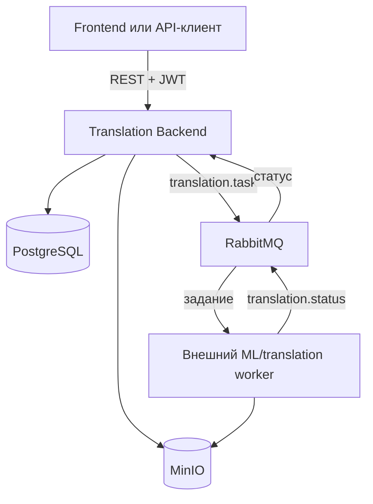
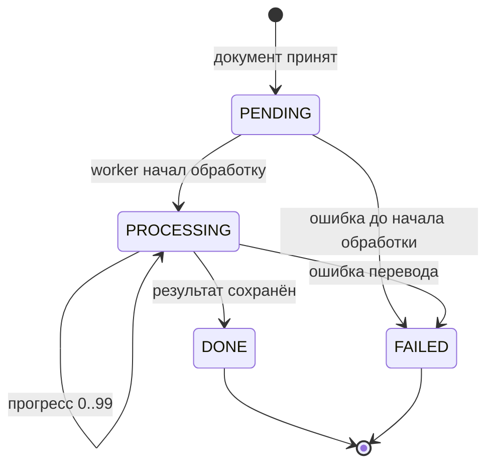

# Translation Backend

Backend сервиса перевода документов с асинхронной обработкой заданий.
Приложение принимает документы, сохраняет их в S3-совместимое хранилище,
публикует задания на перевод в RabbitMQ и предоставляет REST API для
отслеживания прогресса и скачивания результата.

> Документация соответствует ветке `master`, коммиту `c35c202`.
> Репозиторий содержит только Java backend. Frontend и сервис, непосредственно
> выполняющий перевод документов, в этот репозиторий не входят.

## Содержание

- [Возможности](#возможности)
- [Архитектура](#архитектура)
- [Технологический стек](#технологический-стек)
- [Структура проекта](#структура-проекта)
- [Быстрый запуск через Docker Compose](#быстрый-запуск-через-docker-compose)
- [Локальный запуск](#локальный-запуск)
- [Конфигурация](#конфигурация)
- [Аутентификация и безопасность](#аутентификация-и-безопасность)
- [REST API](#rest-api)
- [Жизненный цикл задания](#жизненный-цикл-задания)
- [Контракт RabbitMQ](#контракт-rabbitmq)
- [Хранение файлов](#хранение-файлов)
- [База данных](#база-данных)
- [Обработка ошибок](#обработка-ошибок)
- [Тестирование](#тестирование)
- [Текущие ограничения](#текущие-ограничения)

## Возможности

- регистрация пользователя;
- вход по email и паролю;
- выдача JWT access token;
- загрузка файлов `DOCX`, `DOC` и `PDF`;
- проверка и нормализация кодов исходного и целевого языков;
- хранение исходных и переведённых файлов в MinIO;
- создание и хранение заданий перевода в PostgreSQL;
- публикация заданий для внешнего worker-сервиса через RabbitMQ;
- приём сообщений о прогрессе и результате перевода;
- получение текущего статуса и прогресса задания;
- получение истории заданий с пагинацией;
- скачивание готового документа;
- единый JSON-формат обрабатываемых ошибок;
- автоматическое применение миграций Flyway;
- health check через Spring Boot Actuator.

## Архитектура



Основной сценарий:

1. Клиент регистрируется или выполняет вход.
2. Клиент загружает документ с JWT в заголовке `Authorization`.
3. Backend сохраняет исходный файл в MinIO.
4. Backend создаёт в PostgreSQL задание со статусом `PENDING`.
5. Backend публикует описание задания в RabbitMQ.
6. Внешний worker забирает задание, выполняет перевод и сохраняет результат в
   MinIO.
7. Worker публикует сообщения `PROCESSING`, `DONE` или `FAILED`.
8. Backend обновляет запись задания.
9. Клиент опрашивает endpoint статуса и скачивает файл после получения `DONE`.

Backend не переводит текст самостоятельно. Его зона ответственности:
аутентификация, API, метаданные заданий, хранение файлов и обмен сообщениями.

## Технологический стек

| Компонент | Технология |
| --- | --- |
| Язык | Java 21 |
| Framework | Spring Boot 4.1.0 |
| REST | Spring Web MVC |
| Аутентификация | Spring Security, OAuth2 Resource Server, JWT HS256 |
| Доступ к данным | Spring Data JPA, Hibernate |
| База данных | PostgreSQL 17 |
| Миграции | Flyway |
| Брокер сообщений | RabbitMQ 4, Spring AMQP |
| Объектное хранилище | MinIO |
| Валидация | Jakarta Validation |
| Мониторинг | Spring Boot Actuator |
| Сборка | Maven Wrapper |
| Контейнеризация | Docker, Docker Compose |

## Структура проекта

```text
src/main/java/com/translatelab/backend
├── auth
│   ├── controller      # регистрация и вход
│   ├── dto             # запросы и ответы auth API
│   ├── exception
│   └── service         # регистрация, вход, создание JWT
├── common
│   ├── exception       # единый формат REST-ошибок
│   └── security        # ответы 401 и 403
├── config
│   ├── JwtConfig
│   ├── RabbitConfig
│   ├── SecurityConfig
│   └── StorageConfig
├── messaging
│   ├── consumer        # получение статусов от worker
│   ├── dto             # контракты RabbitMQ
│   ├── exception
│   └── publisher       # публикация заданий
├── storage
│   ├── StorageInitializer
│   ├── exception
│   └── service         # операции MinIO и генерация object key
├── translation
│   ├── controller      # REST API документов
│   ├── dto
│   ├── entity
│   ├── exception
│   ├── repository
│   └── service
└── user
    ├── entity
    ├── exception
    └── repository

src/main/resources
├── application.properties
└── db/migration        # миграции Flyway
```

## Требования

Для запуска всего доступного в репозитории стека через Compose необходимы:

- Docker с поддержкой Docker Compose;
- свободные порты, указанные в `.env`;
- внешний worker для реального выполнения перевода.

Для запуска backend без Docker необходимы:

- JDK 21;
- доступные PostgreSQL, RabbitMQ и MinIO;
- корректно заданные переменные окружения.

## Быстрый запуск через Docker Compose

### 1. Клонирование

```bash
git clone https://github.com/IVecheruk/translation-backend.git
cd translation-backend
```

### 2. Создание `.env`

Linux/macOS:

```bash
cp .env.example .env
```

Windows PowerShell:

```powershell
Copy-Item .env.example .env
```

Замените как минимум:

- `POSTGRES_PASSWORD`;
- `RABBITMQ_PASSWORD`;
- `MINIO_SECRET_KEY`;
- `JWT_SECRET`.

Значение `JWT_SECRET` должно быть Base64-строкой, после декодирования содержащей
не менее 32 байт.

Linux/macOS:

```bash
openssl rand -base64 32
```

Windows PowerShell:

```powershell
$secretBytes = New-Object byte[] 32
$rng = [Security.Cryptography.RandomNumberGenerator]::Create()
$rng.GetBytes($secretBytes)
[Convert]::ToBase64String($secretBytes)
$rng.Dispose()
```

Скопируйте полученную строку в `.env`:

```dotenv
JWT_SECRET=полученное_base64_значение
```

Значение `replace_with_valid_base64_secret` из `.env.example` не является
рабочим JWT-секретом.

### 3. Запуск

```bash
docker compose up --build -d
```

Проверка контейнеров:

```bash
docker compose ps
```

Просмотр логов backend:

```bash
docker compose logs -f backend
```

Остановка:

```bash
docker compose down
```

Остановка с удалением данных PostgreSQL, RabbitMQ и MinIO:

```bash
docker compose down -v
```

Команда с `-v` удаляет именованные volumes и предназначена только для случаев,
когда сохранённые локальные данные больше не нужны.

### Сервисы Compose

| Сервис | Адрес по умолчанию | Назначение |
| --- | --- | --- |
| Backend | `http://localhost:8080` | REST API |
| PostgreSQL | `localhost:5433` | метаданные пользователей и заданий |
| RabbitMQ AMQP | `localhost:5672` | обмен сообщениями |
| RabbitMQ Management | `http://localhost:15672` | интерфейс управления |
| MinIO API | `http://localhost:9000` | S3-совместимый API |
| MinIO Console | `http://localhost:9001` | интерфейс управления файлами |

Порты могут быть изменены в `.env`.

Compose запускает `backend`, `postgres`, `rabbitmq` и `minio`. Translation/ML
worker в `compose.yaml` отсутствует, поэтому без внешнего worker задания
останутся в `PENDING`.

## Локальный запуск

Можно запустить инфраструктуру в Docker, а backend — из IDE или Maven:

```bash
docker compose up -d postgres rabbitmq minio
```

Linux/macOS:

```bash
./mvnw spring-boot:run
```

Если у файла Maven Wrapper нет права на выполнение:

```bash
bash mvnw spring-boot:run
```

Windows:

```powershell
.\mvnw.cmd spring-boot:run
```

Приложение импортирует файл `.env` благодаря настройке:

```properties
spring.config.import=optional:file:.env[.properties]
```

## Конфигурация

### Backend и PostgreSQL

| Переменная | Значение по умолчанию в приложении | Назначение |
| --- | --- | --- |
| `BACKEND_PORT` | `8080` в Compose | внешний порт backend |
| `POSTGRES_HOST` | `localhost` | адрес PostgreSQL |
| `POSTGRES_PORT` | `5432` | порт PostgreSQL для приложения |
| `POSTGRES_DB` | `translation_lab` | имя базы данных |
| `POSTGRES_USER` | `postgres` | пользователь БД |
| `POSTGRES_PASSWORD` | обязательна | пароль пользователя БД |

В `.env.example` внешний порт PostgreSQL равен `5433`. Внутри Docker-сети
backend подключается к `postgres:5432`; Compose устанавливает эти значения
непосредственно для контейнера backend.

### JWT

| Переменная | Значение по умолчанию | Назначение |
| --- | --- | --- |
| `JWT_SECRET` | обязательна | Base64-ключ HS256, минимум 32 байта после декодирования |
| `JWT_ACCESS_TOKEN_TTL` | `1h` | срок действия access token |

`JWT_ACCESS_TOKEN_TTL` использует формат `Duration`, например `30m`, `1h`,
`12h` или `1d`.

### MinIO

| Переменная | Значение по умолчанию | Назначение |
| --- | --- | --- |
| `MINIO_ENDPOINT` | `http://localhost:9000` | endpoint MinIO |
| `MINIO_ACCESS_KEY` | обязательна | access key |
| `MINIO_SECRET_KEY` | обязательна | secret key |
| `MINIO_BUCKET` | `translation-documents` | bucket документов |
| `MINIO_PORT` | `9000` | внешний S3 API порт |
| `MINIO_CONSOLE_PORT` | `9001` | внешний порт консоли |

При старте `StorageInitializer` проверяет bucket и создаёт его, если он
отсутствует. Имя bucket валидируется: длина от 3 до 63 символов, строчные
латинские буквы, цифры, точки и дефисы.

### RabbitMQ

| Переменная | Значение по умолчанию | Назначение |
| --- | --- | --- |
| `RABBITMQ_HOST` | `localhost` | адрес брокера |
| `RABBITMQ_PORT` | `5672` | AMQP-порт |
| `RABBITMQ_MANAGEMENT_PORT` | `15672` | порт management UI |
| `RABBITMQ_USER` | `translation_app` | пользователь |
| `RABBITMQ_PASSWORD` | обязательна | пароль |
| `RABBITMQ_VHOST` | `translation` | virtual host |
| `RABBITMQ_TRANSLATION_EXCHANGE` | `translation.exchange` | direct exchange |
| `RABBITMQ_TRANSLATION_QUEUE` | `translation.tasks` | очередь заданий |
| `RABBITMQ_TRANSLATION_ROUTING_KEY` | `translation.task` | routing key заданий |
| `RABBITMQ_TRANSLATION_STATUS_QUEUE` | `translation.status` | очередь статусов |
| `RABBITMQ_TRANSLATION_STATUS_ROUTING_KEY` | `translation.status` | routing key статусов |

Exchange и обе очереди создаются как durable. Сообщения сериализуются в JSON.

## Аутентификация и безопасность

Приложение использует stateless-аутентификацию:

- HTTP session не создаётся;
- CSRF, form login и HTTP Basic отключены;
- пароли хешируются `BCryptPasswordEncoder`;
- access token подписывается алгоритмом `HS256`;
- JWT передаётся как Bearer token;
- refresh token и endpoint выхода не реализованы.

JWT содержит:

| Claim | Значение |
| --- | --- |
| `sub` | UUID пользователя |
| `email` | нормализованный email |
| `iat` | время выдачи |
| `exp` | время окончания действия |

Публичные endpoints:

- `POST /api/auth/register`;
- `POST /api/auth/login`;
- `GET /actuator/health`.

Все остальные запросы требуют:

```http
Authorization: Bearer <accessToken>
```

При работе с документами UUID пользователя берётся из claim `sub`. Запрос
статуса, истории или файла ограничен данными этого пользователя. Для задания
другого пользователя возвращается тот же ответ `404`, что и для
несуществующего задания.

## REST API

Базовый адрес локального API:

```text
http://localhost:8080
```

JSON-свойства чувствительны к указанному стилю имён. Auth API использует
`camelCase`, а часть document API — явно заданные имена `snake_case`.

### Сводная таблица

| Метод | Endpoint | Доступ | Успешный статус |
| --- | --- | --- | --- |
| `POST` | `/api/auth/register` | публичный | `201 Created` |
| `POST` | `/api/auth/login` | публичный | `200 OK` |
| `POST` | `/api/documents/upload` | Bearer JWT | `202 Accepted` |
| `GET` | `/api/documents/{jobId}/status` | Bearer JWT | `200 OK` |
| `GET` | `/api/documents/{jobId}/download` | Bearer JWT | `200 OK` |
| `GET` | `/api/documents/history` | Bearer JWT | `200 OK` |
| `GET` | `/actuator/health` | публичный | `200 OK` при готовности |

### Регистрация

```http
POST /api/auth/register
Content-Type: application/json
```

Тело:

```json
{
  "email": "user@example.com",
  "password": "strong-password"
}
```

Ограничения:

- `email` обязателен, должен быть корректным email и не длиннее 320 символов;
- `password` обязателен, длина от 8 до 72 символов;
- перед сохранением email очищается от пробелов по краям и переводится в
  нижний регистр;
- email должен быть уникальным.

Ответ `201 Created`:

```json
{
  "id": "6b9fd5fe-f930-4c90-b610-b7c2672a71b7",
  "email": "user@example.com",
  "createdAt": "2026-07-27T08:15:30.123Z"
}
```

Пример:

```bash
curl -X POST http://localhost:8080/api/auth/register \
  -H "Content-Type: application/json" \
  -d '{"email":"user@example.com","password":"strong-password"}'
```

Возможные ошибки:

- `400 Bad Request` — ошибка валидации или некорректный JSON;
- `409 Conflict` — пользователь с таким email уже существует.

### Вход

```http
POST /api/auth/login
Content-Type: application/json
```

Тело:

```json
{
  "email": "user@example.com",
  "password": "strong-password"
}
```

Ограничения:

- `email` обязателен, валиден и не длиннее 320 символов;
- `password` обязателен и не длиннее 72 символов;
- минимальная длина пароля при входе отдельно не проверяется;
- email нормализуется так же, как при регистрации.

Ответ `200 OK`:

```json
{
  "accessToken": "eyJhbGciOiJIUzI1NiIsInR5cCI6IkpXVCJ9...",
  "tokenType": "Bearer",
  "expiresIn": 3600
}
```

`expiresIn` указан в секундах.

Пример:

```bash
curl -X POST http://localhost:8080/api/auth/login \
  -H "Content-Type: application/json" \
  -d '{"email":"user@example.com","password":"strong-password"}'
```

Возможные ошибки:

- `400 Bad Request` — ошибка валидации или некорректный JSON;
- `401 Unauthorized` — неверный email или пароль.

### Загрузка документа

```http
POST /api/documents/upload
Authorization: Bearer <accessToken>
Content-Type: multipart/form-data
```

Параметры:

| Имя | Тип | Обязательный | Описание |
| --- | --- | --- | --- |
| `file` | multipart file | да | непустой файл `DOCX`, `DOC` или `PDF` |
| `source_lang` | string | да | код исходного языка |
| `target_lang` | string | да | код целевого языка |

Коды языков:

- очищаются от пробелов;
- приводятся к нижнему регистру;
- должны состоять из 2 или 3 латинских букв;
- должны различаться.

Поддерживаемые расширения определяются по имени файла без учёта регистра:

- `.docx`;
- `.doc`;
- `.pdf`.

Пример:

```bash
curl -X POST http://localhost:8080/api/documents/upload \
  -H "Authorization: Bearer $TOKEN" \
  -F "file=@document.docx" \
  -F "source_lang=en" \
  -F "target_lang=ru"
```

В PowerShell рекомендуется вызывать `curl.exe`, поскольку `curl` в некоторых
версиях PowerShell является псевдонимом другой команды.

Ответ `202 Accepted`:

```json
{
  "job_id": "f4c553fc-40cf-4104-b050-a0717799c6f5"
}
```

На этом этапе перевод ещё не выполнен: задание только принято и опубликовано
для worker.

Возможные ошибки:

- `400 Bad Request` — пустой файл, неподдерживаемое расширение, неверный код
  языка или одинаковые языки;
- `401 Unauthorized` — JWT отсутствует, повреждён или просрочен;
- `404 Not Found` — пользователь из JWT отсутствует в БД;
- `503 Service Unavailable` — недоступны MinIO или RabbitMQ.

Если файл сохранён и запись создана, но публикация в RabbitMQ завершилась
ошибкой, задание переводится в `FAILED`, а API возвращает `503`.

### Получение статуса

```http
GET /api/documents/{jobId}/status
Authorization: Bearer <accessToken>
```

Пример:

```bash
curl http://localhost:8080/api/documents/f4c553fc-40cf-4104-b050-a0717799c6f5/status \
  -H "Authorization: Bearer $TOKEN"
```

Ответ `200 OK`:

```json
{
  "job_id": "f4c553fc-40cf-4104-b050-a0717799c6f5",
  "status": "PROCESSING",
  "progress": 45,
  "error_message": null
}
```

Значения `status`: `PENDING`, `PROCESSING`, `DONE`, `FAILED`.

Возможные ошибки:

- `400 Bad Request` — `jobId` не является UUID;
- `401 Unauthorized` — нет корректного JWT;
- `404 Not Found` — задание не найдено или принадлежит другому пользователю.

### Скачивание результата

```http
GET /api/documents/{jobId}/download
Authorization: Bearer <accessToken>
```

Пример:

```bash
curl -L \
  http://localhost:8080/api/documents/f4c553fc-40cf-4104-b050-a0717799c6f5/download \
  -H "Authorization: Bearer $TOKEN" \
  --output translated-document.docx
```

Скачивание доступно только для задания со статусом `DONE`.

Backend возвращает:

- `Content-Disposition: attachment`;
- имя `translation-{jobId}.{extension}`;
- MIME-тип, соответствующий исходному формату задания.

| Формат | Content-Type |
| --- | --- |
| DOCX | `application/vnd.openxmlformats-officedocument.wordprocessingml.document` |
| DOC | `application/msword` |
| PDF | `application/pdf` |

Возможные ошибки:

- `400 Bad Request` — `jobId` не является UUID;
- `401 Unauthorized` — нет корректного JWT;
- `404 Not Found` — задание не найдено или принадлежит другому пользователю;
- `409 Conflict` — задание ещё не завершено или завершено с ошибкой;
- `503 Service Unavailable` — файл не удалось получить из MinIO.

### История переводов

```http
GET /api/documents/history?page=0&size=20
Authorization: Bearer <accessToken>
```

Параметры:

| Параметр | По умолчанию | Ограничение |
| --- | --- | --- |
| `page` | `0` | целое число не меньше 0 |
| `size` | `20` | целое число от 1 до 100 |

Результаты отсортированы от нового задания к старому по `created_at`.

Пример:

```bash
curl "http://localhost:8080/api/documents/history?page=0&size=20" \
  -H "Authorization: Bearer $TOKEN"
```

Ответ `200 OK`:

```json
{
  "items": [
    {
      "job_id": "f4c553fc-40cf-4104-b050-a0717799c6f5",
      "source_lang": "en",
      "target_lang": "ru",
      "format": "docx",
      "status": "DONE",
      "progress": 100,
      "created_at": "2026-07-27T08:30:00Z",
      "updated_at": "2026-07-27T08:31:45Z",
      "error_message": null
    }
  ],
  "page": 0,
  "size": 20,
  "total_elements": 1,
  "total_pages": 1,
  "first": true,
  "last": true
}
```

Формат сериализуется в нижнем регистре: `docx`, `doc` или `pdf`. Статус
сериализуется в верхнем регистре.

Возможные ошибки:

- `400 Bad Request` — неверные значения `page` или `size`;
- `401 Unauthorized` — нет корректного JWT.

### Health check

```http
GET /actuator/health
```

Пример:

```bash
curl http://localhost:8080/actuator/health
```

Типичный ответ:

```json
{
  "status": "UP"
}
```

## Жизненный цикл задания



| Статус | Прогресс | Значение |
| --- | --- | --- |
| `PENDING` | `0` | задание создано и ожидает worker |
| `PROCESSING` | `0..99` | worker обрабатывает документ |
| `DONE` | `100` | результат готов |
| `FAILED` | `0..99` | обработка завершилась ошибкой |

Правила:

- новое задание всегда создаётся как `PENDING` с прогрессом `0`;
- прогресс обновляется только в `PROCESSING`;
- прогресс не может уменьшаться;
- `DONE` требует непустой `result_file_key` и прогресс `100`;
- `FAILED` требует непустой `error_message`;
- задание `DONE` нельзя перевести в `FAILED`;
- задание `FAILED` нельзя перевести в `DONE`;
- повторное `DONE` допустимо только с тем же `result_file_key`;
- повторные и устаревшие сообщения `PROCESSING` для терминального задания
  игнорируются после проверки структуры сообщения.

## Контракт RabbitMQ

### Топология

Используется durable `DirectExchange`.

| Назначение | Exchange | Queue | Routing key |
| --- | --- | --- | --- |
| Задания Java → worker | `translation.exchange` | `translation.tasks` | `translation.task` |
| Статусы worker → Java | `translation.exchange` | `translation.status` | `translation.status` |

Имена могут быть изменены через переменные окружения.

### Задание перевода: Java → worker

```json
{
  "job_id": "f4c553fc-40cf-4104-b050-a0717799c6f5",
  "file_key": "uploads/6b9fd5fe-f930-4c90-b610-b7c2672a71b7/8a126287-175f-4b39-a775-121d8477106f.docx",
  "source_lang": "en",
  "target_lang": "ru",
  "format": "docx"
}
```

| Поле | Тип | Описание |
| --- | --- | --- |
| `job_id` | UUID | идентификатор задания |
| `file_key` | string | object key исходного файла в настроенном bucket |
| `source_lang` | string | нормализованный код исходного языка |
| `target_lang` | string | нормализованный код целевого языка |
| `format` | string | `docx`, `doc` или `pdf` |

`file_key` — это ключ объекта внутри bucket, а не URI вида `s3://...`.

### Статус: worker → Java

Worker публикует сообщения в тот же exchange с routing key статусов.

`PROCESSING`:

```json
{
  "job_id": "f4c553fc-40cf-4104-b050-a0717799c6f5",
  "status": "PROCESSING",
  "progress": 45,
  "result_file_key": null,
  "error_message": null
}
```

`DONE`:

```json
{
  "job_id": "f4c553fc-40cf-4104-b050-a0717799c6f5",
  "status": "DONE",
  "progress": 100,
  "result_file_key": "results/f4c553fc-40cf-4104-b050-a0717799c6f5.docx",
  "error_message": null
}
```

`FAILED`:

```json
{
  "job_id": "f4c553fc-40cf-4104-b050-a0717799c6f5",
  "status": "FAILED",
  "progress": 45,
  "result_file_key": null,
  "error_message": "Не удалось обработать структуру документа"
}
```

Требования:

| Статус | `progress` | `result_file_key` | `error_message` |
| --- | --- | --- | --- |
| `PROCESSING` | `0..99` | должен быть `null` | должен быть `null` |
| `DONE` | строго `100` | непустой, максимум 1024 символа | должен быть `null` |
| `FAILED` | `0..99` | должен быть `null` | непустой |
| `PENDING` | — | — | worker не имеет права устанавливать этот статус |

Важно:

- пустая строка не равна `null`: поля, которые должны отсутствовать, следует
  отправлять как JSON `null` или не передавать;
- некорректное сообщение и сообщение с неизвестным `job_id` отклоняются без
  повторной постановки в очередь;
- отдельная dead-letter queue в текущей конфигурации не создаётся;
- worker должен сохранить результирующий объект в том же настроенном MinIO
  bucket до публикации `DONE`.

## Хранение файлов

Backend использует bucket из `MINIO_BUCKET`.

Ключ исходного файла:

```text
uploads/{userId}/{randomUuid}.{extension}
```

Пример:

```text
uploads/6b9fd5fe-f930-4c90-b610-b7c2672a71b7/8a126287-175f-4b39-a775-121d8477106f.docx
```

Имя, присланное пользователем, не используется как object key. Это исключает
конфликты имён и скрывает исходное имя в структуре хранилища.

Ключ результата формирует worker и передаёт в `result_file_key`. Backend
проверяет только то, что ключ непустой и не длиннее 1024 символов.

При ошибке сохранения задания после загрузки объекта backend пытается удалить
загруженный исходный файл. При ошибке публикации RabbitMQ запись переводится в
`FAILED`; исходный объект остаётся в MinIO.

## База данных

Схема создаётся и обновляется только миграциями Flyway. Hibernate работает в
режиме:

```properties
spring.jpa.hibernate.ddl-auto=validate
```

То есть Hibernate проверяет соответствие схемы entity-классам, но не изменяет
таблицы.

### Таблица `users`

| Колонка | Тип | Ограничения |
| --- | --- | --- |
| `id` | UUID | primary key |
| `email` | VARCHAR(320) | not null, unique |
| `password_hash` | VARCHAR(255) | not null |
| `created_at` | TIMESTAMP WITH TIME ZONE | not null, default current timestamp |

### Таблица `translation_jobs`

| Колонка | Тип | Ограничения |
| --- | --- | --- |
| `id` | UUID | primary key |
| `user_id` | UUID | not null, FK → `users.id` |
| `source_file_key` | VARCHAR(1024) | not null |
| `result_file_key` | VARCHAR(1024) | nullable |
| `source_lang` | VARCHAR(16) | not null |
| `target_lang` | VARCHAR(16) | not null |
| `status` | VARCHAR(32) | `PENDING`, `PROCESSING`, `DONE`, `FAILED` |
| `progress` | INTEGER | not null, от 0 до 100 |
| `file_format` | VARCHAR(16) | `DOCX`, `DOC`, `PDF` |
| `created_at` | TIMESTAMP WITH TIME ZONE | not null |
| `updated_at` | TIMESTAMP WITH TIME ZONE | not null |
| `error_message` | TEXT | nullable |

Индексы:

- `idx_translation_jobs_user_id`;
- `idx_translation_jobs_status`;
- `idx_translation_jobs_created_at`.

Связь `TranslationJob → User` загружается лениво (`FetchType.LAZY`).
`spring.jpa.open-in-view=false`, поэтому необходимые данные должны читаться
внутри транзакций сервисного слоя.

### Миграции

| Версия | Назначение |
| --- | --- |
| `V1__init_schema.sql` | создание `users`, `translation_jobs`, ограничений и индексов |
| `V2__uppercase_file_formats.sql` | перевод значений форматов в верхний регистр |
| `V3__add_progress_to_translation_jobs.sql` | добавление `progress` и CHECK `0..100` |

## Обработка ошибок

Обрабатываемые REST-ошибки имеют структуру:

```json
{
  "timestamp": "2026-07-27T08:40:00.123Z",
  "status": 400,
  "message": "Ошибка валидации запроса",
  "path": "/api/auth/register",
  "fieldErrors": {
    "email": "must be a well-formed email address"
  }
}
```

`fieldErrors` использует `camelCase`, поскольку для этого поля не задано
отдельное JSON-имя.

| HTTP-статус | Основные причины |
| --- | --- |
| `400 Bad Request` | валидация DTO, некорректный JSON/UUID/параметр, формат файла, параметры загрузки или пагинации |
| `401 Unauthorized` | нет JWT, JWT некорректен/просрочен, неверный email или пароль |
| `403 Forbidden` | аутентифицированному пользователю запрещена операция |
| `404 Not Found` | пользователь или задание не найдено |
| `409 Conflict` | email занят или результат ещё не готов |
| `503 Service Unavailable` | ошибка MinIO или публикации в RabbitMQ |

Сообщения внутренних инфраструктурных исключений не возвращаются клиенту:
они записываются в лог, а клиент получает общее сообщение о временной
недоступности сервиса.

## Тестирование

Запуск тестов:

Linux/macOS:

```bash
./mvnw test
```

Windows:

```powershell
.\mvnw.cmd test
```

Текущий набор тестов проверяет:

- загрузку Spring context;
- успешную регистрацию;
- нормализацию email и хеширование пароля;
- конфликт занятого email;
- успешный вход;
- неверные учётные данные;
- валидацию auth-запросов и некорректного JSON;
- ответы `401` при отсутствующем и некорректном JWT;
- переходы `TranslationJob` между состояниями;
- ограничения и монотонность прогресса;
- правила завершения и ошибки задания.

Сборка production-образа выполняет:

```bash
./mvnw clean package -DskipTests
```

Поэтому тесты следует запускать отдельно до сборки Docker-образа.

## Текущие ограничения

Документация описывает фактически реализованное состояние проекта.

- В репозитории нет translation/ML worker, поэтому backend сам не переводит
  документы.
- В `compose.yaml` отсутствуют worker и frontend.
- Статус обновляется через polling REST API; WebSocket/SSE не реализованы.
- OpenAPI/Swagger UI не подключены.
- Refresh token, logout, роли и управление аккаунтом не реализованы.
- Ограничение максимального размера загружаемого файла явно не настроено.
- Формат проверяется по расширению имени файла; MIME-тип и фактическое
  содержимое документа не проверяются.
- Список поддерживаемых языков не задан: backend принимает любой код из 2 или
  3 латинских букв.
- CORS-конфигурация отсутствует.
- Для RabbitMQ не настроены retry policy и dead-letter queue.
- Автоматическая очистка исходных и результирующих объектов не реализована.
- Интеграционные тесты PostgreSQL, RabbitMQ и MinIO отсутствуют.
- Healthcheck контейнера backend вызывает `curl`, но Dockerfile отдельно не
  устанавливает его. Наличие `curl` зависит от базового образа; это следует
  проверить при запуске Compose.

## Репозиторий

[github.com/IVecheruk/translation-backend](https://github.com/IVecheruk/translation-backend)
