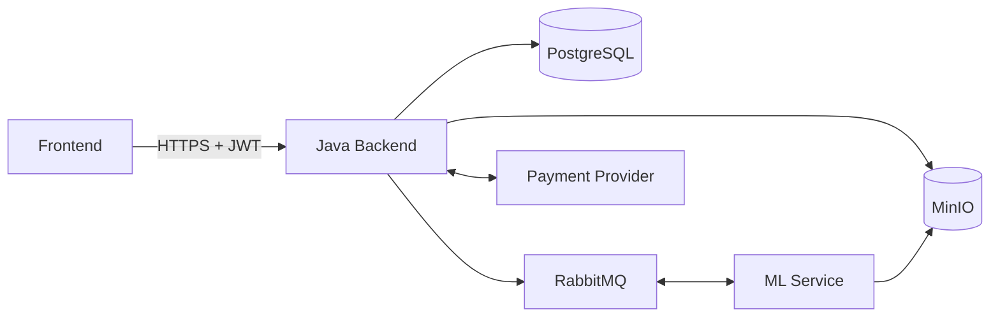

# TranslateLab Java Backend

Java-модуль сервиса перевода документов. Backend отвечает за аккаунты,
профиль пользователя, приём документов, хранение метаданных, лимиты
использования, тарифы и интеграцию с внешними сервисами.

Frontend и ML-сервис, непосредственно выполняющий перевод, разрабатываются
отдельно и в этот репозиторий не входят.

## Возможности

- регистрация и вход по email и паролю;
- stateless-аутентификация через JWT;
- личный профиль и аватар;
- загрузка документов `DOCX`, `DOC` и `PDF`;
- асинхронная постановка документов в очередь перевода;
- получение статуса, прогресса и истории заданий;
- скачивание готового результата;
- бесплатные и платные тарифы;
- контроль лимитов использования;
- каталог доступных предложений подписки;
- создание безопасного внешнего checkout;
- идемпотентное подтверждение успешной оплаты;
- единый JSON-формат ошибок;
- миграции базы данных через Flyway;
- опциональная документация OpenAPI/Swagger UI;
- запуск приложения и инфраструктуры через Docker Compose.

## Зона ответственности Java-модуля

Java backend владеет:

- аутентификацией и авторизацией;
- REST API приложения;
- пользователями и профилями;
- метаданными заданий в PostgreSQL;
- файлами в MinIO;
- контрактами обмена сообщениями с ML-сервисом;
- тарифами, подписками и лимитами;
- серверной частью платёжного процесса.

Java backend не выполняет перевод текста самостоятельно. Эту работу делает
внешний ML-сервис.

## Архитектура



Основной сценарий перевода:

1. Пользователь входит в аккаунт.
2. Frontend загружает документ в Java backend.
3. Backend проверяет формат и доступный лимит.
4. Исходный файл сохраняется в MinIO.
5. Задание, расход лимита и outbox-событие атомарно сохраняются в PostgreSQL.
6. Фоновый outbox-worker передаёт задание ML-сервису через RabbitMQ и ждёт
   publisher confirm.
7. ML-сервис публикует прогресс и итоговый статус.
8. Frontend получает актуальное состояние через Java API.
9. Готовый документ скачивается через Java backend.

## Технологический стек

| Компонент | Технология |
| --- | --- |
| Язык | Java 21 |
| Framework | Spring Boot 4.1.0 |
| REST | Spring Web MVC |
| Безопасность | Spring Security, OAuth2 Resource Server, JWT |
| База данных | PostgreSQL, Spring Data JPA, Hibernate |
| Миграции | Flyway |
| Брокер сообщений | RabbitMQ, Spring AMQP |
| Объектное хранилище | MinIO |
| HTTP-клиент | Spring RestClient |
| API-документация | springdoc-openapi, Swagger UI |
| Сборка | Maven Wrapper |
| Контейнеризация | Docker, Docker Compose |

## Структура исходного кода

```text
src/main/java/com/translatelab/backend
├── auth           # регистрация, вход и JWT
├── common         # общие ошибки и security-ответы
├── config         # конфигурация приложения
├── messaging      # обмен заданиями и статусами
├── payment        # тарифные предложения и платёжный процесс
├── plan           # планы и права использования
├── storage        # работа с MinIO
├── subscription   # подписки пользователей
├── translation    # документы и задания перевода
├── usage          # лимиты и учёт использования
└── user           # пользователи, профиль и аватар

src/main/resources
├── application.properties
└── db/migration   # миграции Flyway
```

## Требования

Для полного локального запуска потребуются:

- Docker Engine с Docker Compose;
- свободные локальные порты для сервисов Compose;
- заполненный файл `.env`;
- внешний ML-сервис для фактического выполнения переводов.

Для запуска Java backend без контейнера также потребуется JDK 21.

## Быстрый запуск через Docker Compose

### 1. Подготовьте окружение

Создайте локальный `.env` из безопасного шаблона.

Windows PowerShell:

```powershell
Copy-Item .env.example .env
```

Linux/macOS:

```bash
cp .env.example .env
```

Замените демонстрационные значения собственными локальными значениями.
Настоящие пароли, ключи и токены должны находиться только в `.env` или в
защищённом хранилище секретов среды развёртывания.

### 2. Запустите приложение

```bash
docker compose up --build -d
```

Проверить состояние контейнеров:

```bash
docker compose ps
```

Проверить готовность backend:

```text
http://localhost:8080/actuator/health
```

Остановить локальный стек:

```bash
docker compose down
```

Compose запускает Java backend, PostgreSQL, RabbitMQ и MinIO. Frontend и
ML-сервис в Compose пока не включены.

## Локальный запуск Java backend

Инфраструктуру можно оставить в Docker:

```bash
docker compose up -d postgres rabbitmq minio
```

Затем запустить приложение из IDE или Maven Wrapper.

Windows:

```powershell
.\mvnw.cmd spring-boot:run
```

Linux/macOS:

```bash
./mvnw spring-boot:run
```

Приложение загружает локальные настройки из `.env`, если файл существует.

## Конфигурация

Полный безопасный перечень параметров находится в `.env.example`. Настройки
разделены на следующие группы:

- адрес и порт backend;
- подключение к PostgreSQL;
- JWT и срок действия access token;
- MinIO и bucket документов;
- RabbitMQ и каналы обмена сообщениями;
- резервирование и очистка лимитов использования;
- OpenAPI/Swagger UI;
- выбор платёжного провайдера и срок действия заявки на покупку;
- включение и сетевые таймауты внешней платёжной интеграции.

Файл `.env.example` содержит только шаблонные значения. Не помещайте реальные
секреты в README, исходный код, сообщения об ошибках или логи.

## Надёжность RabbitMQ

- Задачи публикуются как persistent-сообщения с mandatory routing и
  correlated publisher confirms.
- HTTP-загрузка не зависит от доступности RabbitMQ: задание и стабильный
  `event_id` сначала фиксируются в PostgreSQL outbox, после чего публикуются
  асинхронно с ограниченным exponential backoff.
- ML-worker должен дедуплицировать задачи по `event_id`: после падения между
  broker ACK и фиксацией ACK в PostgreSQL допустима повторная доставка.
- Основные очереди — durable classic: `translation.tasks.v2` и
  `translation.status.v2`. Для текущего одиночного RabbitMQ это осознанный MVP.
  Для production-кластера с репликацией следует создать новые versioned quorum
  queues и переключить конфигурацию без переобъявления существующих очередей.
- Обе очереди имеют DLX/DLQ, ограничение длины и политику
  `reject-publish-dlx`. Некорректные статусы карантинируются; временные ошибки
  обрабатываются ограниченным retry с backoff.
- По умолчанию: task queue — 10 000 сообщений, status queue — 50 000,
  payload — не более 64 KB, prefetch — 10, consumers — 1..4.
- Глубина DLQ, исчерпание retry/outbox публикуются как Micrometer-метрики и
  отражаются в журнале без содержимого сообщений.

## Аутентификация

Приложение использует stateless JWT-аутентификацию. После входа клиент получает
access token и передаёт его в защищённые запросы:

```http
Authorization: Bearer <access-token>
```

Идентификатор пользователя берётся из проверенного JWT. Клиент не передаёт UUID
аккаунта отдельным параметром для операций с профилем, документами, лимитами или
покупками.

Пароли сохраняются только в виде BCrypt-хеша. Платёжные реквизиты пользователя
Java backend не принимает и не хранит.

## Пользовательский REST API

Локальный базовый адрес:

```text
http://localhost:8080
```

| Метод | Endpoint | Доступ | Назначение |
| --- | --- | --- | --- |
| `POST` | `/api/auth/register` | публичный | регистрация |
| `POST` | `/api/auth/login` | публичный | получение JWT |
| `GET` | `/api/subscription-offers` | публичный | каталог активных предложений |
| `POST` | `/api/documents/upload` | JWT | загрузка документа |
| `GET` | `/api/documents/{jobId}/status` | JWT | статус и прогресс |
| `GET` | `/api/documents/{jobId}/download` | JWT | скачивание результата |
| `GET` | `/api/documents/history` | JWT | история переводов |
| `GET` | `/api/profile` | JWT | получение профиля |
| `PUT` | `/api/profile` | JWT | изменение профиля |
| `PUT` | `/api/profile/avatar` | JWT | загрузка или замена аватара |
| `GET` | `/api/profile/avatar` | JWT | получение аватара |
| `DELETE` | `/api/profile/avatar` | JWT | удаление аватара |
| `GET` | `/api/account/usage` | JWT | тариф и доступный лимит |
| `POST` | `/api/subscription-purchases` | JWT | начало покупки подписки |
| `GET` | `/actuator/health` | публичный | состояние приложения |

Служебные callback-маршруты внешних интеграций намеренно не документируются в
публичном README.

## Документы

Загрузка выполняется как `multipart/form-data` и принимает:

- `file` — непустой `DOCX`, `DOC` или `PDF`;
- `source_lang` — код исходного языка;
- `target_lang` — код целевого языка.

Коды языков нормализуются и должны различаться. При успешной загрузке backend
возвращает `202 Accepted` и идентификатор задания. Дальнейшая обработка проходит
асинхронно.

Backend не доверяет расширению и клиентскому `Content-Type`: PDF проверяется по
сигнатуре и разбираемости, DOCX — как Word OOXML-контейнер с защитой от
архивных бомб, DOC — как legacy Word OLE2-документ. По умолчанию размер файла
ограничен 20 MB. Проверка выполняется до записи в MinIO, расходования лимита и
публикации задачи.

Статусы задания:

| Статус | Значение |
| --- | --- |
| `PENDING` | задание принято и ожидает обработки |
| `PROCESSING` | ML-сервис выполняет перевод |
| `DONE` | результат готов к скачиванию |
| `FAILED` | обработка завершилась ошибкой |

Задания, история и файлы доступны только владельцу аккаунта.
Исходники и результаты удаляются планировщиком по настраиваемой retention-
политике; после удаления результата скачивание возвращает `410 Gone`.

## Профиль и аватар

Профиль является приватной частью личного кабинета. Он поддерживает отображаемое
имя, username и дополнительную информацию о пользователе.

Аватар:

- хранится в MinIO, а не внутри PostgreSQL;
- доступен только владельцу аккаунта;
- принимает JPEG или PNG;
- ограничен размером 2 MiB;
- проверяется по типу и сигнатуре содержимого.

## Тарифы и лимиты

Java backend самостоятельно определяет доступный пользователю тариф и проверяет
лимит перед запуском перевода. Значения из frontend не используются как источник
прав доступа.

Бесплатный тариф предоставляет ограниченное число переводов за период. Активная
платная подписка заменяет бесплатные права соответствующими условиями тарифа.

Текущий расход и оставшийся лимит доступны через:

```http
GET /api/account/usage
```

## Платёжный процесс

Платёжные реквизиты обрабатываются внешним провайдером. Java backend участвует
только в создании checkout и подтверждении результата.

Последовательность покупки:

1. Frontend получает публичный каталог предложений.
2. Авторизованный пользователь выбирает тариф.
3. Frontend отправляет backend только технический код тарифа.
4. Backend самостоятельно берёт доверенные цену, валюту и условия из базы.
5. Backend создаёт внешний checkout.
6. В ответ frontend получает HTTPS `redirect_url`.
7. Frontend открывает эту ссылку и передаёт пользователя платёжному провайдеру.
8. Провайдер подтверждает результат напрямую Java backend.
9. После успешной проверки подписка активируется идемпотентно.

Frontend не должен считать переход по `redirect_url` подтверждением оплаты.
Источником истины остаётся состояние подписки на backend.

Платёжная интеграция выключена по умолчанию и включается только в настроенной
среде. Реальные provider-ключи и внутренние callback-контракты не должны
появляться в клиентском коде или публичной документации.

## OpenAPI и Swagger UI

Документация API выключена по умолчанию. Для локальной разработки её можно
включить безопасным параметром конфигурации `OPENAPI_DOCS_ENABLED=true`.

После запуска доступны:

```text
http://localhost:8080/swagger-ui/index.html
http://localhost:8080/v3/api-docs
```

Не рекомендуется включать Swagger UI в публичной production-среде без
дополнительного контроля доступа.

## Обработка ошибок

Ожидаемые REST-ошибки возвращаются в едином JSON-формате с HTTP-статусом,
безопасным сообщением, временем и путём запроса. Ошибки валидации дополнительно
содержат сообщения по полям.

Внутренние адреса инфраструктуры, object key, секреты, подписи, тела внешних
callback-запросов и технические причины ошибок не возвращаются API-клиенту.

## Тестирование

Запуск полного набора тестов:

Windows:

```powershell
.\mvnw.cmd test
```

Linux/macOS:

```bash
./mvnw test
```

Набор покрывает unit-, MVC-, security-, repository- и интеграционные сценарии.
Полные интеграционные тесты ожидают доступные
локальные PostgreSQL, RabbitMQ и MinIO.

## Текущие ограничения

- Frontend и ML-сервис отсутствуют в этом репозитории.
- Без внешнего ML-сервиса задания не будут фактически переведены.
- Получение текущей подписки отдельной ручкой личного кабинета ещё не
  реализовано.
- Полный provider-specific lifecycle продления и отмены подписки ещё не
  подключён к внешним событиям.
- WebSocket и SSE не реализованы; frontend получает состояние через REST.
- ML-сервис обязан поддержать `event_id` и идемпотентную обработку повторно
  доставленных задач.
- Публичная production-конфигурация CORS определяется после согласования с
  frontend-модулем.

## Дополнительная документация

- `Проект_сервис_перевода_документов.md` — исходная спецификация продукта;
- `JAVA_ML_DOCUMENT_CONTRACT.md` — проверка файлов, DOCX-лимиты и retention-
  граница между Java и ML;
- `ACCOUNT_PROFILE_SUBSCRIPTION_ARCHITECTURE.md` — принятые решения для
  аккаунта, профиля, подписок и лимитов;
- `DEVELOPMENT_STATUS.md` — актуальный технический статус Java-модуля.
